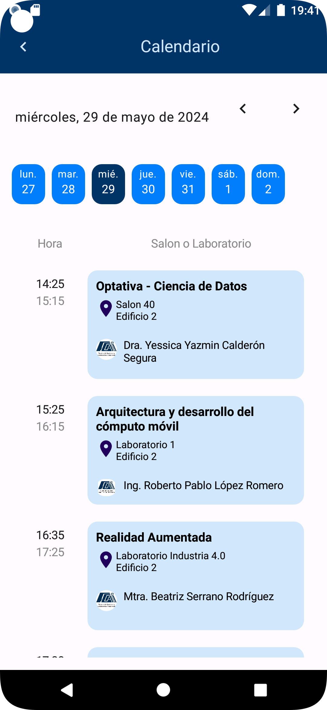
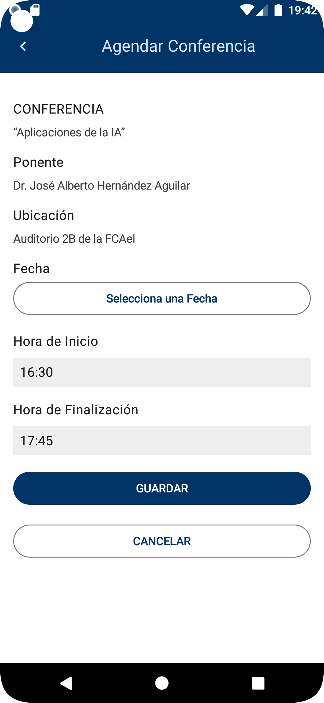

# Introducción

Presentamos este proyecto con el objetivo de abordar una problemática recurrente que afecta tanto al inicio de cada semestre como a lo largo de este.

## Requisitos
Este proyecto fue desarrollado en [JetPack Compose](https://developer.android.com/develop/ui/compose?hl=es-419).

### Requisitos previos

Para el montaje de esta App, se necesita contar con el siguiente software y servicio:

- Android Studio
- Conexión con [Firebase](https://firebase.google.com/?hl=es-419)

### Material de referencia.

En los siguientes enlaces se puede encontrar la documentación oficial de las tecnologías utilizadas para el desarrollo del proyecto:
- [Firebase](https://firebase.google.com/docs/projects/learn-more?hl=es-419)
- [Firebase Authentication](https://firebase.google.com/docs/auth?hl=es_419).
- [Cloud Store](https://firebase.google.com/docs/storage?hl=es_419)
- [Documentación oficial de JetPack Compose](https://developer.android.com/develop/ui/compose/tutorial?hl=es-419)
- [Curso de Jetpack Compose](https://www.youtube.com/watch?v=0UjtLmAO1SA&list=PL8ie04dqq7_ORKWIwiaSTcyBKtasZtNUD)

## Capturas de pantalla de la aplicación.

A continuación, se muestran capturas de pantalla de la aplicación y todas sus Screens:

- SplashScreen:
  - 
- WelcomeScreen:
  - 
- RegisterScreen:
  - 
  - 
- LoginScreen:
  - 
- ForgetPasswordScreen:
  - 
  - 
  - 
- HomeScreen:
  - 
- CalendarScreen:
  - 
- AddConferenceScreen:
  - 
- ContactsScreen:
  - 

## Créditos.

Este proyecto fue desarrollado por:

- Elizabeth Paulina Arévalo Sandoval.
    - [GitHub](https://github.com/elizabeth-arevalo)
    - [Facebook](https://www.facebook.com/Izel.Are/)
    - [LinkedIn](https://www.linkedin.com/in/elizabeth-paulina-ar%C3%A9valo-sandoval-2875b0228/)
- Marco Antonio Hernández Magni.
    - [GitHub](https://github.com/Magni007)
- Jesús Javier Flores Pérez.
    - [GitHub](https://github.com/jjavierohara)
    - [Facebook](https://www.linkedin.com/in/elizabeth-paulina-ar%C3%A9valo-sandoval-2875b0228/)
    - [Instagram](https://www.instagram.com/soyjavier_99/)
